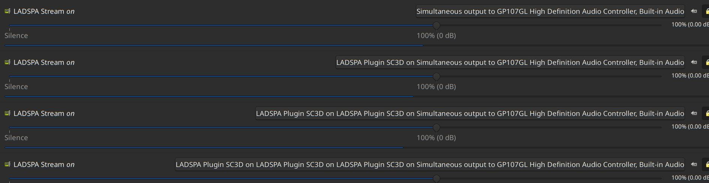

# sc3d

A LADSPA plugin for giving 'depth' to stereo sound. A mod of the SC4 compressor of SWH collection of LADSPA plugins.

Dowload and  extract the SWH collection of LADSPA plugins from https://github.com/swh/ladspa/

Download the Makefile.diff, POTFILE.diff and sc3d_2567.xml to home folder.

Copy sc3d_2567 to the SWH LADSPA source directory.

Patch the Makefile and po/POTFILES.in using following commmands:

<code>
 
patch Makefile < /home/user/Makefile.diff
patch po/POTFILES.in < /home/user/POTFILES.diff
</code>
 
Build the SWH plugins using instructions in REAME.

Copy the sc3d_2567.so from .libs directory to /usr/lib/ladspa.

Change the pulseaudio config file /etc/pulse/default.pa to include following lines (replace master=output with whatever is the output sink name) :

<code>
 
load-module module-ladspa-sink sink_name=ladspa_output.sc3d1 label=sc3d plugin=sc3d_2567 master=output control=1,50,300,-64,32,0.65
load-module module-ladspa-sink sink_name=ladspa_output.sc3d2 label=sc3d plugin=sc3d_2567 master=ladspa_output.sc3d1 control=1,50,300,-64,32,0.65
load-module module-ladspa-sink sink_name=ladspa_output.sc3d3 label=sc3d plugin=sc3d_2567 master=ladspa_output.sc3d2 control=0,200,750,-64,32,0.65
load-module module-ladspa-sink sink_name=ladspa_output.sc3d label=sc3d plugin=sc3d_2567 master=ladspa_output.sc3d3 control=0,200,750,-64,32,0.65

...

set-default-sink ladspa_output.sc3d
</code>

Restart pulseaudio and, if all things are OK, the stereo output will have a 'depth' effect to it on any stereo music / sounds that are played.

The Pulseaudio volume control should have 4 "Ladspa Plugin" settings as in screenshot below
 
 

